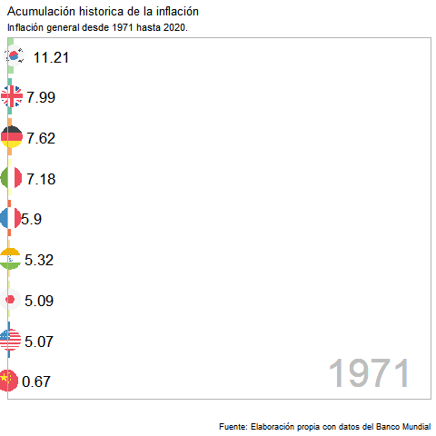

```{r packages-setup, include = FALSE}
library(tidyverse)
library(klippy)   #remotes::install_github("rlesur/klippy")
library(knitr)
library(rio)
library(readxl)
library(countrycode)
library(ggflags)
library(rnaturalearth)
library(rnaturalearthdata)
library(hrbrthemes)
library(kableExtra)
options(knitr.table.format = "html")
library(streamgraph)
library(viridis)
library(DT)
library(plotly)
library(gganimate)
library(xts)
library(dygraphs)
library(treemap)
library(gifski)
library(rgdal)
library(broom)
library(scales)
library(sp)
library(gt)
pacman::p_load(raster, rgdl, rgeos, broom)
pacman::p_load(knitr, here, tidyverse, patchwork, ggrepel)
pacman::p_load(sf, rnaturalearth, rnaturalearthdata, ggspatial, mapview, leafem, leaflet)

#devtools::install_github("dgrtwo/gganimate")
#install.packages ("treemap")
#install.packages("hrbrthemes")
#install.packages("kableExtra")
#devtools::install_github("hrbrmstr/streamgraph")
#if (!require("devtools")) 
  #install.packages("devtools")

#devtools::install_github("sjmgarnier/viridis")

```


```{r chunk-setup, include = FALSE}
knitr::opts_chunk$set(echo = TRUE, eval = TRUE, message = FALSE, warning = FALSE, 
                      #results = "hold",
                      cache = FALSE, cache.path = "/caches/", comment = "#>",
                      #fig.width = 7, #fig.height= 7,   
                      #out.width = 7, out.height = 7,
                      collapse = TRUE,  fig.show = "hold",
                      fig.asp = 0.628, out.width = "95%", fig.align = "center")
knitr::opts_chunk$set(dev = "png", dev.args = list(type = "cairo-png"))
```

```{r options-setup, include = FALSE}
options(scipen = 999) #- para quitar la notación científica
options("yaml.eval.expr" = TRUE) 
```


```{r klippy, echo = FALSE}
klippy::klippy(position = c("top", "right")) #- remotes::install_github("rlesur/klippy")
```

<div style="text-align: justify"><div/>

<hr class="linea-black">

<!-- El párrafo de abajo has de dejarlo casi igual, solo HAS de SUSTITUIR "perezp44" por tu usuario de Github-->
Trabajo elaborado para la asignatura "Programación y manejo de datos en la era del Big Data" de la Universitat de València durante el curso 2021-2022. El repo del trabajo está [aquí](https://github.com/fran2200/trabajo_BigData_equipo){target="_blank"}. 

<!-- El párrafo de abajo has de dejarlo exactamente igual, NO has de cambiar nada-->

La página web de la asignatura y los trabajos de mis compañeros pueden verse [aquí](https://perezp44.github.io/intro-ds-21-22-web/07-trabajos.html){target="_blank"}.

<hr class="linea-red">


## 1. Introducción

Para la asignatura de "Programación y manejo de datos en la era del Big Data" hemos decidido realizar un ensayo (en formato rmd) de relevancia general que afecta a todos los ciudadanos (especialmente a los agentes con menor poder adquisitivo), como es la **inflación**.  

**Resumen:** El encarecimiento de los precios de la energía, junto la falta de microprocesadores y los estímulos monetarios más ambiciosos en la historia reciente, están ocasionando la aparición de datos de inflación que no se alcanzaban desde la crisis del petróleo de los años 70. En particular, la economía europea, y en especial la española, se encuentran en el peor momento posible para afrontar este desajuste en una de las principales variables macroeconómicas, los precios. Esta circunstancia, está afectando especialmente a las rentas más bajas y generando un problema de desabastecimiento de ciertos productos a escala mundial, en uno de los contextos más inciertos del reciente siglo como consecuencia de la evolución de la crisis sanitaria provocada por el COVID-19.

**The Abstract:** Rising energy prices, together with the lack of microprocessors and the most ambitious monetary stimuli in recent history, are causing the emergence of inflation data that had not been reached since the oil crisis of the 1970s. In particular, The European economy, and especially the Spanish one, is in the worst possible moment to face this imbalance in one of the main macroeconomic variables, prices. This circumstance is especially affecting the lowest incomes and generating a problem of shortages of certain products on a global scale, in one of the most uncertain contexts of the recent century as a consequence of the evolution of the health crisis caused by COVID-19.

**Palabras Clave:** Energía, Inflación, España, Europa, BCE, microprocesadores, precio, precios, gas, precios de la energía, expectativa.

<br>

## 2. Motivaciones

La **inflación** es una de las principales variables macroeconómicas que mayor distorsión de expectativas pueden generar en los agentes económicos. ¿Por qué? se puede preguntar el lector. Esto es debido a que la fluctuación en precios es un concepto básico que todo individuo de una sociedad, independientemente de si dispone de ciertos conocimientos económicos, rápidamente sabe analizar e interpretar. Este efecto, bajo el supuesto de racionalidad de los agentes que interactúan en la economía, ocasiona un cambio en la toma de decisiones. La conclusión es clara, a mayores precios, es decir, a mayor cantidad de unidades monetarias requeridas para la compra de un determinado bien, menor será la satisfacción que nos da dicho intercambio. Si este efecto lo trasladamos al conjunto de bienes de una economía, las conclusiones són las mismas, los agentes económicos (por norma general) dispondremos de menor poder adquisitivo, por lo tanto, seremos más pobres.

Consideramos que el tema de estudio de la inflación es un tema actual, que afecta a la mayoría de las economías desarrolladas y del que no hay un cierto consenso dentro de la comunidad económica sobre sus principales causas y, especialmente,  su  evolución en el corto/medio plazo.

En el momento que estamos desarrollando este breve artículo, la inflación a nivel mundial se encuentra “disparada” si la comparamos con la media histórica de los últimos 20 años en la gran mayoría de economías. Por poner en contexto al lector, el pasado octubre la economía estadounidense registró una de sus mayores tasas de inflación en los últimos 20 años, un 6,2%. Alemania, otra economía caracterizada por tener ciertos recelos a presentar datos de inflación elevados, también registra tasas superiores al 4%. La tónica inflacionista  no es un efecto único de la economía germana, sinó que se está observando en la mayoría de economías que conforman la Unión Europea.

<br>

::: columns
::: {.column width="32%"}
-   Record de inflación:

```{r, echo = FALSE, out.width = "60%"}
tweetrmd::tweet_embed("https://twitter.com/rdomenechv/status/1465936143787171840?s=20", theme = "light", align = "center", dnt = TRUE, maxwidth = 400)
```
:::

::: {.column width="1%"}
<!-- an empty Div (with a white space) haciendo de separador -->
:::

::: {.column width="32%"}
-   Que hacer ante la subida del IPCA, ¿Subida de tipos de interes?

```{r, echo = FALSE, out.width = "60%"}
tweetrmd::tweet_embed("https://twitter.com/dfuentescastro/status/1454437169968336897?s=20", theme = "light", align = "center", dnt = TRUE, maxwidth = 400)
```
:::

::: {.column width="1%"}
<!-- an empty Div (with a white space) haciendo de separador -->
:::

::: {.column width="32%"}
-   Importancia del augmento de las energias

```{r, echo = FALSE, out.width = "60%"}
tweetrmd::tweet_embed("https://twitter.com/heimbergecon/status/1463762368127766530?s=20", theme = "light", align = "center", dnt = TRUE, maxwidth = 400)
```
:::
:::

<br>

Las **motivaciones** que nos ha llevado a la elección de esta tema són varias;

- Estudiar este fenómeno tan excepcional en las economías europeas, y especialmente en nuestra economía doméstica. Desde que empezamos a interesarnos por el mundo de las ciencias económicas no hemos vivido un período de alta inflación, por tanto, es una circunstancia que nos llama muchísimo la atención.

- Desarrollar tanto los conocimientos económicos (teóricos y prácticos) que hemos adquirido en la carrera, como en el curso de  R.Studio. Al respecto de este punto, queremos remarcar que nos ha llamado particularmente la atención la gran variedad de gráficos profesionalizados, como los anteriormente expuestos, que referentes economistas están compartiendo para analizar el tema de interés. Esta es una motivación extra para nuestro artículo, tratar de crear gráficos profesionalizados.

> Nuestro principal objetivo es tratar de dar respuesta de cuáles són las principales causas de la inflación y cómo puede afectar al crecimiento de nuestra economía en el corto/medio plazo.

<br>

## 3. Datos utilizados{.tabset .tabset-pills}


### Comentarios

Para la realización del trabajo ha sido necesaria la obtención de información procedente de diversas fuentes como por ejemplo el INE y Eurostat.

Para poder utilizar estos datos ha sido necesario modificarlos y adaptarlos antes de emplearlos y hacer gráficas. Esta adaptación la podemos encontrar dentro del apartado tidy, donde se recogen todas las modificaciones realizadas desde la descarga de un archivo como puede ser xlsx o cvs hasta tener un data frame cargado en el Global Environment.


-----------------------

<br>

### Tidy 

```{r echo=TRUE, warning=FALSE }

#Hemos adquirido un dataframe de la inflación por agrupaciones, por ello cargamos el dataframe para poder observarlo en Data y lo convertimos en formato long. 
inflacion_agrupaciones <- read_excel("datos/inflacion_agrupaciones.xlsx")

inflacion_agrupaciones <- inflacion_agrupaciones %>% pivot_longer(cols = 3:63, names_to = "date") 

#Una vez lo hemos hecho, las variables data y value estaban en formato character, por ello hemos tenido que exportar este documento y cambiar estas variables a fomato numérico manualmente, obteniendo así el data frame inflacion_agrup. Una vez hecho esto podemos cargar directamente. 

inflacion_agrup <- inflacion_agrupaciones

#rio::export(inflacion_agrup, "./datos/inflacion_agrup.csv")

inflacion_agrup <- read_csv("datos/inflacion_agrup.csv", 
    col_types = cols(date = col_date(format = "%Y"), 
        value = col_number()))

```

```{r, echo = TRUE, warning= FALSE}
#DATOS PARA LOS PAISES.

#Hemos realizado los pasos anteriores pero esta vez aplicandolos al dataframe que contienen los paises, obteniendo un nuevo dataframe inflacion_country que podemos cargar directamente. 
inflacion_paises <- read_excel("datos/inflacion_paises.xlsx")
inflacion_paises <- inflacion_paises %>% pivot_longer(cols = 4:64, names_to = "date") 
inflacion_paises$code<-tolower(countrycode(inflacion_paises$country_name,origin = 'country.name', destination = 'iso2c'))

#Una vez lo hemos hecho, las variables data y value estaban en formato character, por ello hemos tenido que exportar este documento y cambiar estas variables a fomato numérico manualmente, obteniendo así el data frame inflacion_country. Una vez hecho esto podemos cargar directamente. 

inflacion_country <- inflacion_paises

#rio::export(inflacion_country, "./datos/inflacion_country.csv")

inflacion_country <- read_csv("datos/inflacion_country.csv", 
    col_types = cols(date = col_date(format = "%Y"), 
        value = col_number()))

```
```{r, echo = TRUE, warning= FALSE}
#DATOS PARA LA CREACIÓN DE MAPAS

#En este paso hemos jutado el dataframe world con el anterior para poder importarle las geometrias y poder hacer mapas.

world <- rnaturalearth::ne_countries(scale = "medium", returnclass = "sf")
world <- world %>% filter(subregion != "Antarctica") %>% filter(admin != "Greenland")
world <- world %>% dplyr::select(name, iso_a3, geometry)

inflacion_geom <- full_join(inflacion_country, world, by = c("country-code" = "iso_a3"))

```

```{r, echo = TRUE, warning= FALSE}

# Para poder realizar un treemap hemos adquirdo datos sobre la evolución de varios componentes y los hemos tratado de la siguiente forma 

contribucion <- read_excel("datos/contribucion.xls")
contribucion <- contribucion %>% pivot_longer(cols = 2:23, names_to = "date") 

#rio::export(contribucion, "./datos/contribucion.csv") 

contribucion <- read_csv("datos/contribucion.csv", 
    col_types = cols(date = col_date(format = "%Y/%m")))

```

```{r, echo = TRUE, warning= FALSE}

# Alguna mierda que hagamos con estos datos 

prc_hicp_manr <- read_excel("datos/prc_hicp_manr.xls")

prc_hicp_manr <- prc_hicp_manr %>% pivot_longer(cols = 2:35, names_to = "date")
prc_hicp_manr <- prc_hicp_manr %>% rename(country = `GEO/TIME`) 

# rio::export(prc_hicp_manr, "./datos/prc_hicp_manr.csv")

prc_hicp_manr <- read_csv("datos/prc_hicp_manr.csv", 
                          col_types = cols(date = col_date(format = "%Y/%m")))

```


```{r, echo = TRUE, warning= FALSE}

inflacion_europea <- read_excel("datos/inflacion_europea.xlsx")

inflacion_europea <- inflacion_europea %>% pivot_longer(cols = 2:35, names_to = "date")
inflacion_europea <- inflacion_europea %>% rename(country = `GEO/TIME`) 

#rio::export(inflacion_europea, "./datos/inflacion_europea.csv")

inflacion_europea <- read_csv("datos/inflacion_europea.csv", 
                              col_types = cols(date = col_date(format = "%Y/%m")))
library(tidyverse)
world <- rnaturalearth::ne_countries(scale = "medium", returnclass = "sf")
world <- world %>% filter(subregion != "Antarctica") %>% filter(admin != "Greenland")
world <- world %>% dplyr::select(name, iso_a3, geometry)

inflacion_geom_europ <- left_join(inflacion_europea, world, by = c("country" = "name")) %>%
  filter(date >= "2020-01-01")

```

```{r, echo = TRUE, warning= FALSE}

inflacion_eurozona <- read_excel("datos/inflacion_eurozona.xlsx")

inflacion_eurozona <- inflacion_eurozona %>% pivot_longer(cols = 3:14, names_to = "date")


#rio::export(inflacion_eurozona,"./datos/inflacion_eurozona.csv")

inflacion_eurozona <- read_csv("datos/inflacion_eurozona.csv", 
    col_types = cols(date = col_date(format = "%Y/%m")))


```

```{r, echo = TRUE, warning= FALSE}

inflacion_esp <- read_excel("datos/inflacion_esp.xlsx")

inflacion_esp <- inflacion_esp  %>% pivot_longer(cols = 2:23, names_to = "date")


#rio::export(inflacion_esp,"./datos/inflacion_esp.csv")

inflacion_esp <- read_csv("datos/inflacion_esp.csv", 
    col_types = cols(date = col_date(format = "%Y/%m")))

```

```{r, echo = TRUE, warning= FALSE}

ponderacion_componentesIPC <- read_excel("datos/ponderacion_componentesIPC.xls")

ponderacion_componentesIPC <- ponderacion_componentesIPC %>% pivot_longer(cols = 2:6, names_to = "date")


#rio::export(ponderacion_componentesIPC,"./datos/ponderacion_componentesIPC.csv")


ponderacion_componentesIPC <- read_csv("datos/ponderacion_componentesIPC.csv", 
                                       col_types = cols(date = col_number(), 
                                                        value = col_number()))

```

```{r, echo = TRUE, warning= FALSE}
 
inflacion_coumindades <- read_excel("datos/inflacion_coumindades.xls")

inflacion_coumindades <- inflacion_coumindades %>% pivot_longer(cols = 2:23, names_to = "date")


#rio::export(inflacion_coumindades,"./datos/inflacion_coumindades.csv")

inflacion_comunidades <- read_csv("datos/inflacion_coumindades.csv", 
    col_types = cols(date = col_date(format = "%Y/%m")))

```

```{r, echo = TRUE, warning= FALSE}

inflacion_provincias <- read_excel("datos/inflacion_provincias.xls")

inflacion_provincias <- inflacion_provincias %>% pivot_longer(cols = 2:23, names_to = "date")

#rio::export(inflacion_provincias,"./datos/inflacion_provincias.csv")

inflacion_provincias <- read_csv("datos/inflacion_provincias.csv", 
    col_types = cols(date = col_date(format = "%Y/%m")))

```

```{r, echo = TRUE, warning= FALSE}
inflacion_var_esp <- read_excel("datos/var_interanual_esp.xlsx")

inflacion_var_esp <- inflacion_var_esp  %>% pivot_longer(cols = 2:360, names_to = "date")

#rio::export(inflacion_var_esp,"./datos/inflacion_var_esp.csv")

inflacion_var_esp <- read_csv("datos/inflacion_var_esp.csv", 
    col_types = cols(date = col_date(format = "%Y/%m")))


```

```{r, echo = TRUE, warning= FALSE}

#Datos en formato polígono para poder eralizar un mapa de coropletas interactivo
shapefile_provincias <- shapefile("shp/Provincias_ETRS89_30N.shp")

#Datos para la realización del gráfico sobre la predicción
prediccion_inflacion <- read_csv("datos/prediccion_inflacion.csv", 
                                 col_types = cols(Value = col_number()))

```

```{r, echo = TRUE, warning= FALSE}
library(readr)

#my_url <- "https://ec.europa.eu/eurostat/api/dissemination/sdmx/2.1/data/SDG_17_40/A.PC_GDP.S13.GD.EU27_2020+BE+BG+CZ+DK+DE+EE+IE+EL+ES+FR+HR+IT+CY+LV+LT+LU+HU+MT+NL+AT+PL+PT+RO+SI+SK+FI+SE+IS+NO+CH+UK/?format=SDMX-CSV&startPeriod=2020&endPeriod=2020"

#curl::curl_download(my_url, "./datos/deuda_eu.csv")

df_csv <- rio::import("./datos/deuda_eu.csv")

deuda_eu <- read_csv("./datos/deuda_eu.csv", 
                    col_types = cols(OBS_VALUE = col_number())) %>%
  dplyr::select(geo, OBS_VALUE) %>%
  mutate(value = OBS_VALUE/100)

```

```{r, echo = TRUE, warning= FALSE}

# Datos del Banco de españa para tratar de analizar la influencia de la inflación en la población 
#Este primero está relacionado con el porcentaje de activos reales que posee cada percentil de renta

datos_esp_prop <- read_excel("datos/datos_esp_prop.xlsx", 
                             col_types = c("text", "numeric", "numeric", 
                                           "numeric", "numeric"))

datos_esp_prop <- datos_esp_prop %>% pivot_longer(cols = 2:5, names_to = "Propiedad")

# Este segundo esta relacionado con la propiedad de activos financieros de cada percentil de renta
datos_esp_inv <- read_excel("datos/datos_esp_inv.xlsx", 
                            col_types = c("text", "numeric", "numeric", 
                                          "numeric", "numeric"))

datos_esp_inv <- datos_esp_inv %>% pivot_longer(cols = 2:5, names_to = "Act_real")


```

```{r, echo = TRUE, warning= FALSE}

# Datos de la OCDE de la prevision del crecimiento del PIB eurozon

crecimiento <- read_csv("datos/crecimiento.csv", 
                        col_types = cols(Value = col_number()))


```


-----------------------

<br>

## 4. Estudio **mundial**

### 4.1 Evolución del mundo

En primer lugar, un breve repaso histórico acerca de la inflación. 

Para la serie histórica analizada se puede observar como la inflación mundial ha experimentado una reducción drástica en los últimos 30 años. 

```{r, echo = TRUE, warning= FALSE}

#GRAFICO 1

p1 <- inflacion_agrup %>%
  filter(country_name == "Mundo") %>%
  filter(date >= 1981) %>% filter(series == "subyacente") %>% 
  dplyr::select(-(series))
p1 <- p1 %>%  dplyr::select(-(country_name))

p11 <- inflacion_agrup %>%
  filter(country_name == "Mundo") %>%
  filter(date >= 1981) %>% filter(series == "general") %>% 
  dplyr::select(-(series))
p11 <- p11 %>%  dplyr::select(-(country_name))

subyacente <- xts(p1$value, order.by = p1$date, frequency = 365) 


general <- xts(p11$value, order.by = p11$date, frequency = 365)

p <- cbind(subyacente,general) 
  
dygraph(p, ylab= "% inflación",
        main = "Evolución Inflación") %>% 
  dyOptions(colors = c("blue", "brownw")) %>% 
  dyRangeSelector()

```

¿A qué se debe esta reducción generalizada para todas las economías ? 
 
Especialmente a los **beneficios de la globalización sobre el crecimiento económico** : La globalización ha generado un *efecto escala*, que se deriva del mayor tamaño de mercado. Este mayor tamaño de mercado incentiva a las empresas a crecer y a adquirir mayores conocimientos, lo cual aumenta la productividad agregada y, con ello, se produce un aumento de la oferta agregada a nivel mundial. A todo esto le tenemos que sumar la importancia del avance tecnológico en las últimas décadas.

<br>

### 4.2 Evolución de las 9 economías principales

#### 4.2.1 Gráfico de lineas

Si desagregamos, se puede confirmar lo anteriormente mencionado, aunque las economías tienen un ajuste diferente todas llegan al mismo destino, a una inflación caracterizada por tasas de crecimiento estables.

```{r, echo = TRUE, warning= FALSE, fig.width=15, fig.height=15}


inflacion_g9 <- inflacion_country %>% mutate(paises = country_name) %>% filter(country_name %in% c("United States","China", "Japan", "Germany", "United Kingdom", "India","France","Italy", "Korea, Rep.")) %>% filter(`Series Name` == "general") 

inflacion_g9 <- ggplot(inflacion_g9, aes(x=date, y=value)) +
  geom_line(data=inflacion_g9 %>% dplyr::select(-country_name), aes(group=paises), color="grey", size=0.5, alpha=1) +
  geom_line( aes(color=country_name), color="#69b3a2", size=1.2 )+
  scale_color_viridis(discrete = TRUE) +
  theme_ipsum() +
  theme(
    legend.position="none",
    plot.title = element_text(size=14),
    panel.grid = element_blank()) +
  
  facet_wrap(~country_name) + theme(plot.subtitle = element_text(family = "serif"),
                                    plot.caption = element_text(family = "serif"),
                                    axis.title = element_text(family = "serif"),
                                    plot.title = element_text(family = "serif")) +
  
  labs(
      caption = "Fuente: Elaboración propia con datos del Banco Mundial") + 
      labs(x = NULL, y = "Valores en %")

```


<center></center>


#### 4.2.2 Inflación acumulada 

Desde que abandonamos el patrón oro, la mayoría de las economías han adoptado por un incremento sostenido y controlado de precios para fomentar su crecimiento. Aunque no vamos a entrar a valorar, ya que daría para otro artículo la efectividad de esta estrategia, desde la crisis del petróleo de los años 70 la economía mundial se ha caracterizado por una estabilidad de precios, al menos, con lo que respecta a las economías del G-20. Ejemplo de este razonamiento lo tenemos en la confianza que el mercado de divisas tiene en las monedas de dicha agrupación (G-20), divisas como el dólar o el euro se han instaurado como activos “seguros”. Toda esta “relativa estabilidad” ha seguido mejorando la confianza internacional a la hora de desarrollar y profundizar en el comercio internacional, potenciando los beneficios anteriormente descritos sobre el conjunto de la economía.

```{r, echo = TRUE, warning= FALSE}

inflacion_barras <- read_excel("datos/inflacion_barras.xlsx", 
                               col_types = c("text", "text", "text", 
                                             "numeric", "numeric", "numeric", 
                                             "text", "numeric")) %>% 
 dplyr::select(-(nada))


inflacion_barras <- inflacion_barras %>% 
  group_by(date) %>% 
  arrange(date, desc(acumulada)) %>% 
  mutate(ranking = row_number()) %>%
  filter(ranking <=9) %>% 
  ungroup() 

tabla_1 <- ggplot(inflacion_barras, aes(ranking, acumulada, country = code, size = 20)) +
  geom_col(aes(ranking, acumulada,  fill = country_name)) +
  scale_fill_brewer(palette = "Spectral") +
  geom_flag(aes(ranking, acumulada, country = code), size = 10) +
  geom_text(aes(ranking, acumulada, label = as.factor(acumulada), size = 40), hjust= -0.5) +
  geom_text(aes(x=9, y=600, label = as.factor(date)), vjust = 0.2, alpha = 0.5,  col = "gray", size = 15) +
  
  scale_x_reverse() +
  coord_flip(clip = "off", expand = FALSE) +
  theme_light() +
  theme(
    panel.grid = element_blank(), 
    legend.position = "none",
    axis.ticks.y = element_blank(),
    axis.title.y = element_blank(),
    axis.text.y = element_blank()) +
  lims(y = c(NA,700)) + theme(axis.line = element_line(colour = NA),
                              axis.ticks = element_line(colour = NA),
                              panel.grid.major = element_line(colour = NA),
                              panel.grid.minor = element_line(colour = NA),
                              axis.text = element_text(colour = NA),
                              plot.background = element_rect(colour = NA)) +labs(x = NULL, y = NULL)+
  labs(title = "Acumulación historica de la inflación",
       subtitle = "Inflación general desde 1971 hasta 2020.",
       caption = "Fuente: Elaboración propia con datos del Banco Mundial") +
  
  transition_states(as.factor(date),transition_length = 1, state_length = 0, wrap = FALSE)

tabla_1 <- tabla_1 +  theme(legend.position = "none") 

#gganimate::animate(tabla_1, nframes = 650, fps = 30)


```

<center></center>


<br>


### 4.3 Mapa de coropletas{.tabset .tabset-pills}

#### Mapa Mundi

Si ampliamos el foco (véase mapa mundi y tablas) **no todas las economías han contribuido en la misma proporción al crecimiento sostenido en precios**, aunque a nivel agregado la tendencia es a una reducción de la tasa de crecimiento de los precios hasta estabilizarse en valores “razonables” desde una perspectiva actual (véase punto 4.4). 

Como se puede apreciar, las economías menos desarrolladas, disponen de mayores tasas de crecimiento en precios, esto se puede a diversidad de factores que no vamos a entrar a analizar, simplemente para hacer saber al lector que no en todos los países del mundo se ha instaurado la estabilidad en precios. Es por eso que no los tendremos en cuenta a la hora de analizar el problema actual, ya que són economías que per se, disponen de tasas de inflación mucho más elevadas que las economías donde la estabilidad en precios si ha sido en la historia más reciente un auténtico éxito. Dicho lo cual, para analizar este problema nos vamos a centrar en el contexto europeo y en especial, en el contexto español. Por variedad de razones;

1. Son economías que comparten política monetaria y moneda común, hecho que facilita el análisis.

2. Son economías similares, donde su estudio nos puede facilitar la comparación.

3. Son el economías que cumplen los requisitos establecido para nuestro análisis (*ruptura de la tendencia en  estabilidad relativa en precios*).

```{r, echo = TRUE, warning= FALSE}

library(lubridate)

inflacion_geom_2 <- inflacion_geom %>%  filter(`Series Name` == "general") %>% 
  mutate(anyo = lubridate::year(date)) %>% 
  group_by(date) %>% 
  filter(anyo >= 2000) %>%
  mutate(deciles = ntile(value, n = 10)) 

mapa <- ggplot() +
  geom_sf(data = inflacion_geom_2, aes(geometry = geometry, fill = deciles)) +
  theme_void()  +
  theme(plot.subtitle = element_text(family = "serif", face = "italic"),
        plot.title = element_text(family = "serif", face =  "italic")) +
  labs(title = "Mapa:Inflación mundial", fill = "Inflación")  +
  scale_fill_continuous(low="#fffcbf",high="#3e9851") + 
  transition_manual(anyo)+
  labs(title = "Año: {current_frame}",
       caption = "Fuente: Elaboración propia con datos del Banco Mundial")

# gganimate::animate(mapa, nframes= 100, fps= 4, end_pause = 5)


```

<center></center>

Note el lector, que para el análisis de dicho problema, también se podría haber estudiado la economía norteamericana y haber extraído conclusiones similares.

-----------------------

<br>

#### Tabla 

```{r, echo = TRUE, warning= FALSE}
inflacion_country_sub <- inflacion_country %>%
  filter(`Series Name` == "subyacente")

inflacion_country_gen <- inflacion_country %>%
  filter(`Series Name` == "general")

tabla_mundo <- left_join(inflacion_country_sub, inflacion_country_gen, by = c("country-code" = "country-code", "date" = "date"))

tabla_mundo <- tabla_mundo %>% 
  dplyr::select(country_name.x, date, value.x, value.y) %>% 
  dplyr::rename(country = country_name.x, subyacente_1 = value.x, general_1 = value.y) %>% filter(country != "Afghanistan") %>% 
  filter(country != "Albania") 

tabla_mundo <- tabla_mundo %>% 
  mutate(subyacente = round(subyacente_1, digits = 2)) %>% 
  mutate(general = round(general_1, digits = 2)) %>% 
  dplyr::select(-c(subyacente_1, general_1))
  
  

datatable(tabla_mundo, class ="stripe hover compact row-border" , filter = 'top')

```
-----------------------

<br>


### 4.4 Comparación por zonas geográficas {.tabset .tabset-pills}

Aquí el lector puede apreciar lo anteriormente expuesto, y consultar en caso de que resulte de su interes la evolución histórica para cada zona geográfica.


#### 4.4.1 América latina VS Mundo 

```{r, echo = TRUE, warning= FALSE}
america_latina <- inflacion_agrup %>% filter(series == "general") %>% 
  filter(country_name %in% c("América Latina y el Caribe", "Mundo")) %>% filter( date >= 1971)

america_latina <- ggplot() +
  geom_line(data = america_latina, aes(date, value, color = country_name), size=1) +
  scale_color_viridis(discrete = TRUE) +
  theme(
    legend.position="none",
    plot.title = element_text(size=14)
  ) +
  ggtitle("Inflacion mundial") +
  theme_ipsum() + theme(plot.subtitle = element_text(family = "serif"),
                        plot.caption = element_text(family = "serif"),
                        axis.title = element_text(family = "serif"),
                        plot.title = element_text(family = "serif")) +labs(title = "Grafica 3: America latina vs Mundo", subtitle = "(Inflación general)",
                                                                           x = NULL, y = "Valores en %") + theme(legend.text = element_text(size = 12),
                                                                                                                                                                                                legend.position = "bottom", legend.direction = "horizontal") +labs(colour = NULL, caption = "Fuente: Elaboración propia con datos del Banco Mundial")

america_latina

```

-----------------------

<br>

#### 4.4.2 América del norte VS Mundo 

```{r, echo = TRUE, warning= FALSE}

america_norte <- inflacion_agrup %>% filter(series == "general") %>% 
  filter(country_name %in% c ("América del Norte", "Mundo")) %>% filter( date >= 1971)

america_norte <- ggplot() +
  geom_line(data = america_norte, aes(date, value, color = country_name), size=1) +
  scale_color_viridis(discrete = TRUE) +
  theme(
    legend.position="none",
    plot.title = element_text(size=14)
  ) +
  ggtitle("Inflacion mundial") +
  theme_ipsum() + theme(plot.subtitle = element_text(family = "serif"),
                        plot.caption = element_text(family = "serif"),
                        axis.title = element_text(family = "serif"),
                        plot.title = element_text(family = "serif")) +labs(title = "Grafica 3: America del Norte vs Mundo", subtitle = "(Inflación general)",
                                                                           x = NULL, y = "Valores en %") + theme(legend.text = element_text(size = 12),
                                                                                                                                                                                                legend.position = "bottom", legend.direction = "horizontal") +labs(colour = NULL, caption = "Fuente: Elaboración propia con datos del Banco Mundial")

america_norte

```


-----------------------

<br>

#### 4.4.3 Unión Europea VS Mundo 

```{r, echo = TRUE, warning= FALSE}

union_europea <- inflacion_agrup %>% filter(series == "general") %>% 
  filter(country_name %in% c("Unión Europea", "Mundo")) %>% filter(date >= 1971) 

union_europea <- ggplot() +
  geom_line(data = union_europea, aes(date, value, color = country_name), size=1) +
  scale_color_viridis(discrete = TRUE) +
  theme(
    legend.position="none",
    plot.title = element_text(size=14)
  ) +
  ggtitle("Inflacion mundial") +
  theme_ipsum() + theme(plot.subtitle = element_text(family = "serif"),
                        plot.caption = element_text(family = "serif"),
                        axis.title = element_text(family = "serif"),
                        plot.title = element_text(family = "serif")) +labs(title = "Grafica 3: Union Europea vs Mundo", subtitle = "(Inflación general)",
                                                                           x = NULL, y = "Valores en %") + theme(legend.text = element_text(size = 12),
                                                                                                                                                                                                legend.position = "bottom", legend.direction = "horizontal") +labs(colour = NULL, caption = "Fuente: Elaboración propia con datos del Banco Mundial")

union_europea

```


-----------------------

<br>

#### 4.4.4 África VS Mundo 

```{r, echo = TRUE, warning= FALSE}

africa_sahara <- inflacion_agrup %>% filter(series == "general") %>% 
  filter(country_name %in% c("África al sur del Sahara", "Mundo")) %>% filter( date >= 1971)

africa_sahara <- ggplot(africa_sahara, aes(date, value, color=country_name)) +
  geom_line(size=1) +
  scale_color_viridis(discrete = TRUE) +
  theme(
    legend.position="none",
    plot.title = element_text(size=14)
  ) +
  ggtitle("Inflacion mundial") +
  theme_ipsum() + theme(plot.subtitle = element_text(family = "serif"),
                        plot.caption = element_text(family = "serif"),
                        axis.title = element_text(family = "serif"),
                        plot.title = element_text(family = "serif")) +labs(title = "Grafica 3: Africa Subsahariana vs Mundo", subtitle = "(Inflación general)",
                                                                           x = NULL, y = "Valores en %") + theme(legend.text = element_text(size = 12),
                                                                                                                 legend.position = "bottom", legend.direction = "horizontal") +labs(colour = NULL, caption = "Fuente: Elaboración propia con datos del Banco Mundial")

africa_sahara

```


-----------------------

<br>

#### 4.4.5 Ásia VS Mundo 

```{r, echo = TRUE, warning= FALSE}

asia_pacifico <- inflacion_agrup %>% filter(series == "general") %>% 
  filter(country_name %in% c("Asia oriental y el Pacífico", "Mundo")) %>% filter( date >= 1971)

asia_pacifico <- ggplot(asia_pacifico, aes(date, value, color=country_name)) +
  geom_line(size=1) +
  scale_color_viridis(discrete = TRUE) +
  theme(
    legend.position="none",
    plot.title = element_text(size=14)
  ) +
  ggtitle("Inflacion mundial") +
  theme_ipsum() + theme(plot.subtitle = element_text(family = "serif"),
                        plot.caption = element_text(family = "serif"),
                        axis.title = element_text(family = "serif"),
                        plot.title = element_text(family = "serif")) +labs(title = "Grafica 3:Asia y el Pacifico vs Mundo", subtitle = "(Inflación general)",
                                                                           x = NULL, y = "Valores en %") + theme(legend.text = element_text(size = 12),
                                                                                                                 legend.position = "bottom", legend.direction = "horizontal") +labs(colour = NULL, caption = "Fuente: Elaboración propia con datos del Banco Mundial")

asia_pacifico

```


-----------------------

<br>

### 4.5 Outliers 2020

Las excepciones anteriormente mencionadas, valores que pueden ser considerados como *"outliers"*, en nuestro estudio. No tiene ningun sentido estudiar el problema inflacionista actual en economias que históricamente presentan distorsiones estructurales en la variable estudio.

```{r echo=TRUE, warning=FALSE}

library(patchwork)

inflacion_country_2 <- inflacion_country %>% mutate(anyo =lubridate::year(date))

inflacion_country_top <- inflacion_country_2 %>%
  filter(`Series Name` == "general") %>%
  filter(anyo == 2020) %>%
  mutate(valor = round(value, digits = 2)) %>%
  mutate(simbolo = "+") %>%
  mutate(simbolo2 = "%") %>%
  slice_max(value, n=5)

deflacion_country_min <- inflacion_country_2 %>% filter(`Series Name` == "general") %>%
  filter( anyo == 2020) %>% 
  mutate(valor = round(value, digits = 2)) %>%
  slice_min(value, n = 5)

  
  
p2 <- ggplot( inflacion_country_top, aes( reorder(country_name, value), value, fill = country_name, country=code, width = 0.5 ))+
  geom_bar( stat = "identity") +
  scale_fill_brewer(palette = "Spectral") +
  geom_flag( y= -18, size=15 ) +
  coord_flip() +
  geom_text( aes(label= simbolo),
             hjust = -0.4, size = 5,
             position = position_dodge(width = 1),
             inherit.aes = TRUE) +
  geom_text( aes(label = valor),
             hjust = -0.4, size = 5,
             inherit. = TRUE) +
  theme(aspect.ratio = 0.5) +
  lims(y= c(NA,700))  + theme(axis.text = element_text(size = 11,
    face = "bold"), axis.text.x = element_text(size = 0,
    colour = "white")) +labs(x = "Valores expresado en %", y = NULL) + theme(panel.background = element_rect(fill = NA)) + theme(plot.subtitle = element_text(size = 14),
    axis.text.x = element_text(vjust = 0),
    plot.title = element_text(size = 15,
        face = "bold")) +labs(title = "Diferencias entre los extremos",
    subtitle = "Paises con mayor inflación y deflación general en 2020") + 
  theme(axis.line = element_line(colour = NA),
    axis.ticks = element_line(colour = NA))  + theme(legend.position = "none")


p3 <- ggplot(deflacion_country_min, aes(reorder(country_name, value), value, fill = country_name, country=code))+
  geom_bar(stat = "identity") +
  geom_flag(y = 2, size = 15) +
  scale_fill_brewer(palette = "Greens") +
  geom_text( aes(label = valor),
             vjust = 1.2, size = 5,
             inherit. = TRUE) +
  geom_text( aes(label = country_name),
             vjust = -2, size = 5,
             inherit. = TRUE) +
  lims(y= c(-31,4)) + 
  theme(plot.subtitle = element_text(size = 14,
    face = "bold"), axis.line = element_line(colour = NA),
    axis.ticks = element_line(colour = NA),
    axis.text = element_text(colour = NA),
    panel.background = element_rect(fill = NA),
    plot.background = element_rect(colour = NA)) +labs( x= NULL, y = NULL,  caption = "Fuente: Elaboración propia con datos del Banco Mundial.") + theme(legend.position = "none")
  


p2 + inset_element(p3, left = 0.3, right = 1, bottom = -0.2, top = 0.8)

```


En resumen y *la conslusión que queremos remarcar antes de entrar en materia*, es que **en los últimos 30 años se ha acelerado el proceso de especialización productiva** (*si no tenemos en cuenta las excepciones*), reduciendo los costes de producción y fomentando el avance tecnológico. Todo esto se traduce en una reducción de los precios de los bienes y servicios que se comercian a nivel internacional, mejorando la calidad de vida de los agentes económicos.

<br>

## 5. Inflación en la actualidad 

El fenómeno anteriormente descrito (reducción mundial de los datos de inflación) también se ha hecho visible en el viejo continente. En los últimos años, casi toda eurozona, se había acostumbrado a que los precios altos dejarán de ser un dolor de cabeza.  Más aún, cuando, a diferencia de otras economías como bien puede ser la estadounidense,  el BCE se ha comprometido, casi desde su creación, a fijar su política monetaria para asegurar que la inflación se estabilice en su objetivo del 2 % a medio plazo.

<br>

### 5.1. Cambio de tendencia

Desde finales de verano de 2021, esta tendencia de estabilidad relativa de precios se ha quebrado.

```{r, echo = TRUE, warning= FALSE}


mapa_2 <- ggplot() +
  geom_sf(data = inflacion_geom_europ, aes(geometry = geometry, fill = value )) +
  theme_void()  +
  theme(plot.subtitle = element_text(family = "serif", face = "italic"),
        plot.title = element_text(family = "serif", face =  "italic")) +
  labs(title = "Mapa:Inflación mundial", fill = "Inflación")  +
  scale_fill_continuous(low="#fffcbf",high="#d7372a") +
  lims(y =c(35,70)) +
  lims(x = c(-20, 40)) + transition_manual(date) +
  labs(title = "Año: {current_frame}",
       caption = "Datos de Eurostat")

gganimate::animate(mapa_2, nframes = 200, fps = 20, end_pause = 6)
```

<br>


### 5.2. Componentes/causas de la inflación


El encarecimiento de la energía, los cuellos de botella de las cadenas de producción y la estratégia en política monetaria adoptada para luchar contra la covid (incremento del flujo monetario en la economía) han despertado a la inflación en la mayoría de las economías.

Si nos centramos en el contexto europeo, la **principal causa de inflación** es clara (*gráfico aportación componentes a la inflación*), los **precios de la energía** han experimentado un repunte exponencial en los dos últimos trimestres. 

Estos altos precios energéticos deben a se deben a varios factores:

- La fuerte revalorización del gas natural en los mercados.
- Subida de los derechos del Co2.Estos derechos han subido en más de un 100 % en tan solo seis meses, algo que afecta en los precios eléctricos diarios en Europa.
- La escasez de oferta y el alto precio del gas natural y carbón está causando un desvío masivo hacia el petróleo y sus derivados para la generación de electricidad y usos industriales, según el  informe sobre el mercado del petróleo que elabora la Agencia Internacional de la Energía (AIE).
- La falta de chips semiconductores (circuitos integrados) son muchos y la solución no va a llegar rápido.


```{r, echo = TRUE, warning= FALSE}

contribucion <- contribucion  %>%
  filter(date == "2021-10-01") %>%
  slice_max (value , n = 20)


componentes_europa <- treemap(contribucion,
                          index="componente",
                          vSize="value",
                          type="index",
                          title="Aportación componentes a la inflación interanual de Octubre 2021",
                          palette="Spectral",
                          border.col=c("white"), 
                          border.lwds=3, 
                          fontface.labels=1,
                          bg.labels=c("transparent"),              
                          align.labels=c("center", "center"),                                  
                          overlap.labels=0.5)


```

<br>

### 5.3. Inflación "en el peor momento"

La **variación interanual** del índice de precios de consumo armonizado (IPCA) para la eurozona fue del 4,4% en octubre, en el momento de su publicación, fue la cifra más alta en la serie histórica de la oficina europea de estadísticas, que arranca en 1997. Este insólito récord ha sido batido solo un mes después, con un nuevo máximo histórico en el dato de variación interanual de precios de consumo armonizado (IPCA) situándose en el 4,9 %, 0,8 p. p. superior al del mes anterior.

Un apunte a destacar, para que el lector pueda formarse una mejor opinión al respecto, es que *estos datos sólo representan una media*, es decir, *como podrá observar mediante la tabla adjunta en el punto 5.4 con los datos de inflación*, tendremos economías por encima del 4,4% y economías por debajo. Alemania, por ejemplo, economía siempre sensible a los movimientos de los precios, llega a tener datos de IPC anual del 4,6% para octubre. **España** se queda en el **5,4%**.  Un solo mes ha bastado para que Eurostat presente **nuevos récords** en los datos de inflación. Alemania incrementa su último dato en 1,4 puntos para llegar su IPC anual al 6%. Bélgica se sitúa en algo más del 7%, y le superan los tres países bálticos (Lituania, Letonia y Estonia). **España**, por su parte, se queda en el **5,6%**. Los únicos países de la zona euro en los que podría hablarse de una inflación contenida son Francia (3,4%) y Portugal (2,7%): De todos modos, la gran mayoría de economías del viejo continente superaron el objetivo establecido en el 2%, anteriormente mencionado.

```{r echo=TRUE, warning=FALSE}

inflacion_eurozona <- inflacion_eurozona %>% filter( TIME == "European Union - 27 countries (from 2020)")

inflacion_eurozona_sub <- inflacion_eurozona %>% filter(Tipo == "subyacente")
inflacion_eurozona_gen <- inflacion_eurozona %>% filter(Tipo == "general")

europa <- ggplot() +
  
  geom_col(data = inflacion_eurozona_sub, aes(date, value, fill = value), color= "grey",  alpha = 0.5) +
  scale_fill_continuous(low="#ffffbf",high="#fee08b")  +
  geom_text(data = inflacion_eurozona_sub, aes(date, value, label = value), y=-0.2 ) +
  geom_text(data = inflacion_eurozona_sub, aes(date, value, label = "%"), y=-0.2, hjust = -1 ) +
  
  geom_line(data = inflacion_eurozona_gen, aes(date, value, color = value),size = 1.5) +
  scale_color_continuous(low="#3288bd",high="#3288bd") +
  geom_text(data = inflacion_eurozona_gen, aes(date, value, label = value), vjust = -2,hjust = 1) +
  geom_text(data = inflacion_eurozona_gen, aes(date, value, label = "%"), vjust = -2, hjust = -0.2) +
  
  geom_point(data = inflacion_eurozona_gen, aes(date, value), size = 4, color = "#3288bd") +
  
  geom_hline(yintercept = 2,
             size = 1.5,
             colour = "#abdda4",
             linetype = "dashed") +
  
  annotate(geom = "text",
           x= as.Date("2020-11-21"),
           y = 2.2,
           label = "Objetivo inflacion 2%",
           size = 4,
           color = "black")  + 
  
  theme(axis.text.x = element_text(angle = 70, hjust = 1)) +
  
  scale_x_date(date_labels="%b %y",date_breaks  ="1 month") +
  
  lims(y= c(-0.3,5)) + 
  
  theme(panel.grid.major = element_line(colour = "darkgray", 
                           linetype = "dashed"), 
        panel.grid.minor = element_line(colour = NA),
        panel.background = element_rect(fill = NA),
        plot.background = element_rect(colour = NA),
        legend.position = "none") +labs(x = NULL, y = "Valores expresados en %") + 
  theme(panel.grid.major = element_line(colour = NA)) +
  theme(legend.position = "right", legend.direction = "horizontal") +
  labs(fill = "Subyacente") + 
  theme(legend.position = c(0.20, 0.8)) +
  labs(colour = "General") + 
  theme(legend.text = element_text(colour = NA),
      legend.title = element_text(face = "bold"),
      legend.key = element_rect(fill = NA),
      legend.background = element_rect(fill = NA))+labs(colour = "General       ") + 
  theme(axis.text = element_text(size = 12,
      face = "bold"), axis.text.y = element_text(size = 12)) + 
  theme(axis.line = element_line(linetype = "solid")) + 
  theme(axis.line = element_line(linetype = "blank"),
      axis.ticks = element_line(colour = NA,
      linetype = "blank"), plot.title = element_text(size = 14,
      face = "bold"), legend.text = element_text(colour = "black")) +labs(title = "Evolución de la inflación en la Comunidad Europea",
      subtitle = "Inclación mensual ", caption = "Fuente: Elaboracón propia con datos de Eurostat") + 
  theme(axis.ticks = element_line(linetype = "solid"),
    axis.text = element_text(colour = NA),
    axis.text.x = element_text(colour = "black")) +labs(subtitle = "Inclación mensual (Europa de los 27)") +
  labs(y = NULL)  

europa

```

Este problema **nos llega en el peor momento** posible para toda la eurozona. Aunque si hay economías con una buena estructura macroeconómica, otras, como el caso de la española o la italiana presentan ciertos desajustes que solo han hecho más que de agravarse desde la llegada de la Covid-19. Cabe recordar que en la UE, la política monetaria está completamente supeditada por el BCE, por tanto las diferentes naciones no gozan de autonomía monetaria. La conclusión es clara, la economía está sufriendo un **shock** dentro de su camino de recuperación del anterior **shock** , uno protagonizado por el alza en precios y otro por la paralización económica como consecuencia de la pandemia, por tanto, el problema original, como a continuación expondremos, solo ha hecho que complicar la incierta situación en la que desgraciadamente en los últimos años nos desenvolvemos.


<br>

### 5.4 Tabla 

```{r}
library(tidyverse)
library(DT)

inflacion_eurozona <- read_csv("datos/inflacion_eurozona.csv", 
                               col_types = cols(date = col_date(format = "%Y/%m")))

inflacion_eurozona_sub <- inflacion_eurozona %>% filter(Tipo == "subyacente") %>% rename(country = TIME) 
inflacion_eurozona_gen <- inflacion_eurozona %>% filter(Tipo == "general") %>% rename(country = TIME) 
tabla_inflacion <- left_join(inflacion_eurozona_gen, inflacion_eurozona_sub, by = c("date" = "date", "country" = "country"))

tabla_inflacion <- tabla_inflacion %>% 
  dplyr::select(country, date, Tipo.x, value.x, Tipo.y, value.y) %>% 
  dplyr::select(-(c(Tipo.x , Tipo.y))) %>% 
  rename(general = value.x, subyacente = value.y) 

datatable(tabla_inflacion, class ="stripe hover compact row-border" , filter = 'top')

```

<br>

## 6 Inflación en el contexto Español.

> El precio de la luz dispara el IPC hasta el 5,6 %, su tasa más alta en 29 años.

### 6.1 General y Subyacente, el efecto inflacionista para España. 

Si nos centramos en el contexto español, la **situación**, como ya avanzamos, es también  **crítica**. El último dato publicado por el Instituto Nacional de Estadística (INE), marca un nuevo pico para la inflación este año (5,6%), **su tasa más alta en 29 años**. Nuestra economía doméstica se encuentra en una tendencia alcista desde el pasado marzo. La implicación económica es clara; se está produciendo un **encarecimiento del coste de la vida**. Las causas són las mismas que las anteriormente mencionadas para el contexto europeo (altos precios de la electricidad y los combustibles, el repunte del consumo y los problemas en las cadenas de suministro globales, falta de contenedores, escasez de trabajadores, carencia de chips…).

```{r echo=TRUE, warning=FALSE , results='hide'}
inflacion_esp_gen <- inflacion_esp %>% filter(tipo == "general")
inflacion_esp_sub <- inflacion_esp %>% filter(tipo == "subyacente")


esp <- ggplot() +
  
  geom_line(data = inflacion_esp_gen, aes(date, value, colour = tipo), size = 1.5) +
  geom_point(data = inflacion_esp_gen, aes(date, value,  colour = tipo, shape = tipo), size = 3) +
  geom_text(data = inflacion_esp_gen, aes(date, value, label = value, colour = tipo), vjust = 2.5,hjust = 0.5, size = 3) +
  geom_text(data = inflacion_esp_gen, aes(date, value, label = "%", colour = tipo), vjust = 2.5,hjust = -1, size = 3) +
  
  geom_line(data = inflacion_esp_sub, aes(date, value,  colour = tipo), size = 1.5) +
  geom_point(data = inflacion_esp_sub, aes(date, value, colour = tipo, shape = tipo), size = 3) +
  geom_text(data = inflacion_esp_sub, aes(date, value, label = value, colour = tipo), vjust = -1.5,hjust = 0.75, size = 3) +
  geom_text(data = inflacion_esp_sub, aes(date, value, label = "%", colour = tipo), vjust = -1.5,hjust = -0.5, size = 3) +
  
  
  scale_color_manual(breaks = c("general", "subyacente"),
                     values=c("#00008B", "#00BFFF")) +
  
  geom_hline(yintercept = 0,
             size = 0.25,
             colour = "black",
             linetype = "dashed") +
  
  scale_x_date(date_labels="%b %y",date_breaks  = "1 month") +
  
  theme(axis.text.x = element_text(angle = 70, hjust = 1)) +
  
  lims(y= c(-1, 6.5)) +
  labs(x = NULL) +
  labs(caption = "Fuente: Elaboración propia con datos de INEbase") +
  theme(panel.grid.major = element_line(colour = NA)) + 
  theme(panel.background = element_rect(fill = "transparent")) +
  theme(legend.title=element_blank()) +
  theme(axis.title.y=element_blank(), axis.text.y=element_blank(),
        axis.ticks.y=element_blank()) +
  labs(colour = "General")  + theme(plot.subtitle = element_text(colour = "gray24"),
    panel.grid.major = element_line(colour = "white"),
    panel.grid.minor = element_line(colour = "white"),
    panel.background = element_rect(colour = "white"),
    legend.position = "bottom", legend.background = element_rect(fill = "transparent"),
    legend.direction = "horizontal") +
  labs(title = "Evolución anual del IPC", subtitle = "Índice general y subyacente.") +
  guides(shape = FALSE) 


#grafico 2


esp_1 <- ggplot() +
  geom_line(data = inflacion_var_esp, aes(date, value), colour = "#212F3D", size = 1.5) +
  
  scale_x_date(date_labels="%Y",date_breaks  ="5 years") +
  
  geom_hline(yintercept =0,
             size = 0.25,
             colour = "black")  + 
  
  annotate("rect",
           xmin = as.Date("2020-01-01"),
           xmax = as.Date("2022-11-01"),
           ymin = -Inf,
           ymax = Inf,
           alpha = 0.4,
           fill = "pink") +
  
  scale_y_continuous(breaks = seq(-1, 6, 1)) +
  labs(title = "Variación en los ultimos 30 años.", subtitle = "Índice general.") +
  theme(axis.line = element_line(size = 0.05,
    linetype = "solid"), panel.grid.major = element_line(colour = "gray88",
    size = 0.25, linetype = "twodash"), panel.grid.minor = element_line(colour = NA),
    axis.text = element_text(face = "italic",
        colour = "gray10"), axis.text.x = element_text(colour = "gray10"),
    panel.background = element_rect(fill = NA,
        colour = "aquamarine4"))+labs(x = NULL, y = NULL)


#esp + inset_element(esp_1, left = 0, right = 0.4, bottom = 0.5, top = 0.9)

```

<center></center>

<br>

### 6.2 Ponderación componentes 


En lo que respecta a la ponderación por componentes, como se puede apreciar, el patrón de pesos de cada partida que considera el INE para calcular el IPC no ha experimentado significativos cambios desde 2017. Puede sorprender que la partida de **04**, aunque  sí ha experimentado un incremento, no es tan marcado como el real, esto se debe simplemente al formato de cálculo. Con todo, el gran incremento del grupo **01** compensa las pequeñas bajadas que han experimentado grupos como **Ocio y cultura** y **Restauración y hoteles**. Bajadas razonables si tenemos en consideración la situación sanitaria de los últimos 2 años.

```{r, echo = TRUE, warning= FALSE}

componentes <- ggplot(ponderacion_componentesIPC, aes(Componentes, value, fill = as_factor(date)))+
  geom_col(position = position_stack(reverse = TRUE)) +
  coord_flip() +
  scale_fill_brewer(palette = "Spectral") + 
  
  
  theme(panel.grid.major = element_line(colour = NA),
    panel.grid.minor = element_line(colour = NA),
    axis.text = element_text(face = "bold"),
    legend.title = element_text(size = 14,
      face = "bold"), panel.background = element_rect(fill = NA),
    plot.background = element_rect(colour = NA),
    legend.position = "bottom", legend.direction = "horizontal") +
    labs(title = "Ponderaciones por grupos IPC",
    x = NULL, y = "Unidades: %1000 en base 2016",
    fill = NULL, subtitle = "Acumulación por grupos del periodo 2017-2021") + 
  theme(legend.position = "left", legend.direction = "vertical") +
  labs(caption = "Fuente: Elaboracion propia con datos del INE")

componentes <- ggplotly(componentes)

componentes

```

<br>

### 6.3 Inflación Comunidades Autónomas/ Provincias.

Si minimizamos el foco de análisis y desagregamos por CCAA, podemos observar como todas, exceptuando **las islas canarias**, disponen de peores datos que la media para la UE_27. Mayores conclusiones podemos extraer si analizamos el problema mediante datos por provincias (véase mapa de provincias). Los mayores datos de inflación se encuentran en aquellas provincias caracterizadas por realizar actividades primarias/secundarias. Una explicación razonable se puede deber a la falta de capacidad de estos sectores para trasladar todo el sobrecoste adicional de los precios de la electricidad y materias primas a los siguientes eslabones en la cadena de valor. Aunque consideramos que puede ser un tema muy interesante, no vamos a entrar a estudiar en profundidad estos subtemas que surgen en nuestro artículo, ya que nos estamos a centrando más en el estudio de la inflación a mayor escala, peró sí nos parece relevante al menos presentar los datos desagregados para observar en qué zonas geográficas de España, la pérdida de poder  adquisitivo de las familias es más acusada.

```{r, echo = TRUE, warning= FALSE}

comunidades <- inflacion_comunidades %>%
  filter(date == "2021-10-01") %>%
  mutate(id = seq(1:19))

number_of_bar <- nrow(comunidades)
angle <-  90 - 360 * (comunidades$id-0.5) /number_of_bar     

comunidades$hjust<-ifelse( angle < -90, 1, 0)

comunidades$angle<-ifelse(angle < -90, angle+180, angle)


p <- ggplot(comunidades, aes( as.factor(id),value, fill=nombre_comunidad)) +       
  geom_bar(stat="identity") +
  scale_fill_manual(breaks = c("Andalucía", "Aragón", "Principado de Asturias","Illes Balears","Canarias","        Cantabria","Castilla y León","Castilla - La Mancha","Cataluña","Comunitat Valenciana","Extremadura","Galicia","Comunidad de Madrid","Región de Murcia","Comunidad Foral de Navarra","País Vasco","La Rioja","Ceuta","Melilla"),
                 values=c("#546e7a", "#fb8c00","#1b5e20","#00897b","#f4511e","#689f38","#ffca28","#4dd0e1","#01579b","#bdbdbd","#1a237e","#82b1ff","#5e35b1","#ffff00","#d500f9","#d4e157","#6d4c41","#e57373","#c51162")) +
  ylim(-5,7) +
  theme_minimal() +
  theme(
    axis.text = element_blank(),
    axis.title = element_blank(),
    panel.grid = element_blank(),
    plot.margin = unit(rep(-1,4), "cm")) +
  
  coord_polar(start = 0) +
  
  geom_text(data=comunidades, aes(id, value+0.5, label=value, hjust=hjust ), color="black", fontface="bold",alpha=0.6, size=5, angle= comunidades$angle, inherit.aes = FALSE ) + labs(fill = "Comunidades") +
  labs(x = NULL, fill = NULL)

p

```


#### Provinicas {.tabset .tabset-pills}

##### Mapa 

```{r, echo = TRUE, warning= FALSE}

data_prov <- tidy(shapefile_provincias)

data_prov$group <- as.character(data_prov$group) 

nombres_provincias <- read_excel("datos/nombres_provincias.xlsx")

data_provincias_mapa <- left_join(data_prov, nombres_provincias, by = "id") %>% rename(prov = shapefile_provincias.Texto)

inflacion_prov <- read_excel("shp/inflacion_prov.xlsx")
inflacion_prov <- inflacion_prov %>% rename(id2 = id)

mapa_prov <- left_join(inflacion_prov, data_provincias_mapa, by = c("id2" = "id")) 


aa <- mapa_prov %>%
  ggplot(aes( x= long, y = lat, group = group)) +
  geom_polygon(aes(fill=value),
               color = "white", size = 0.2) +
  labs( title = "Tasa de Riesgo de Pobreza por Comunidades Autónomas",
        subtitle = "Unidades: Porcentaje",
        caption = "Fuente: INE",
        fill = "Tasa (%)") +
  theme_minimal() +
  theme(
    axis.line = element_blank(),
    axis.text = element_blank(),
    axis.title = element_blank(),
    axis.ticks = element_blank(),
    plot.background = element_rect(fill = "snow", color = NA),
    panel.background = element_rect(fill= "snow", color = NA),
    plot.title = element_text(size = 16, hjust = 0),
    plot.subtitle = element_text(size = 12, hjust = 0),
    plot.caption = element_text(size = 8, hjust = 1),
    legend.title = element_text(color = "grey40", size = 8),
    legend.text = element_text(color = "grey40", size = 7, hjust = 0),
    legend.position = c(0.93, 0.3),
    plot.margin = unit(c(0.5,2,0.5,1), "cm")) +
  theme_minimal() +
  theme(
    axis.line = element_blank(),
    axis.text = element_blank(),
    axis.title = element_blank(),
    axis.ticks = element_blank(),
    panel.background = element_rect(colour= "darkgrey", size= 0.5)) +
  ggtitle("Provincias Españolas")


aa <- ggplotly(aa)
aa


```

```{r, echo = TRUE, warning= FALSE}

provincia_max <- inflacion_provincias %>% filter(date == "2021-10-01") %>% slice_max(value, n=1) %>% 
  dplyr::select(-date) %>% 
  rename(inflacion = value)

banderas <- c("https://upload.wikimedia.org/wikipedia/commons/6/63/Bandera_de_Le%C3%B3n_%28ciudad%29.svg", "https://upload.wikimedia.org/wikipedia/commons/b/bf/Bandera_de_la_provincia_de_Toledo.svg")


provincia_max_urls <- provincia_max %>% group_by(nombre_provincia) %>% 
  add_column(banderas) %>% ungroup()


Tabla_max <- provincia_max_urls %>% gt()

Tabla_max <- Tabla_max %>%
  tab_header(title = md("**Provincia con mayor inflación**"),subtitle = md("A fecha: 01-10-2021"))

Tabla_max <- Tabla_max %>%
  tab_options(heading.background.color = "#9ccc65") %>% tab_options(heading.title.font.size = 15, heading.subtitle.font.size = 13,  column_labels.font.weight =  "bold")


Tabla_max <- Tabla_max  %>%
  gt::text_transform(locations = cells_body(columns = vars(banderas)), fn = function(x) {gt::web_image(x, height = 50)}) %>%  cols_align(
    align = "center")


provincia_min <- inflacion_provincias %>% filter(date == "2021-10-01") %>% 
slice_min(value, n=1) %>% 
  dplyr::select(-date) %>% rename(inflacion = value)


bandera <- c("https://upload.wikimedia.org/wikipedia/commons/9/9c/Bandera_Provincial_de_Las_Palmas.png")


provincia_min_urls <- provincia_min %>% group_by(nombre_provincia) %>% 
  add_column(bandera) %>% ungroup()


Tabla_min <- provincia_min_urls %>% gt()

Tabla_min <- Tabla_min %>%
  tab_header(title = md("**Provincia con menor inflación**"),subtitle = md("A fecha: 01-10-2021"))

Tabla_min <- Tabla_min %>%
  tab_options(heading.background.color = "#9ccc65") %>% tab_options(heading.title.font.size = 15, heading.subtitle.font.size = 13,  column_labels.font.weight =  "bold")


Tabla_min <- Tabla_min  %>%
  gt::text_transform(locations = cells_body(columns = vars(bandera)), fn = function(x) {gt::web_image(x, height = 50)}) %>%  cols_align(
    align = "center")

```

::: {.column width="47%"}

<center></center>

:::

::: {.column width="1%"}
<!-- an empty Div (with a white space) haciendo de separador -->
:::

::: {.column width="47%"}

<center></center>

:::


-----------------------

<br>

##### Tabla

```{r, echo = TRUE, warning= FALSE}

inflacion_provincias <- inflacion_provincias %>%
  filter(date == "2021-10-01") %>% 
  rename(inflacion = value) 
  

datatable(inflacion_provincias, class ="stripe hover compact row-border" , filter = 'top')

```

-----------------------

<br>

### 6.4. La dependencia energética

Para el caso español esta situación (*aumento de los precios energéticos*) le perjudica en mayor medida. Como es bien sabido, nuestra economía se caracteriza por una **fuerte dependencia energética exterior**. Si consultamos los últimos datos del Instituto Nacional de Estadística (INE), en España apenas **se produce un tercio de la energía que se consume**. Estos datos sitúan a España como uno de los países de la Unión Europea más dependientes energética, ya que la media de la UE se sitúa cerca del 50%. Este factor es clave para entender, en parte, el problema actual, y es una de las **variables en las que se debería empezar a centrar España**. Si no es así, las futuras fluctuaciones del precio de la energía, generan inestabilidades en el coste de vida periódicamente, y en paralelo a los shocks. El futuro es incierto, y aunque se ha gozado de un período de estabilidad, nadie nos garantiza que las fluctuaciones no se repitan de forma prolongada. 

<br>

## 7. Consecuencias de la inflación

Una inflación suficientemente alta perjudica a **todo** el mundo (*o a casi todo el mundo*), especialmente cuando ésta es prolongada. Pero si tomamos como referencia las hipótesis que están adoptando organismos internacionales y banco central europeo:

<br>

::: columns

```{r, echo = FALSE, out.width = "60%"}
tweetrmd::tweet_embed("https://twitter.com/elEconomistaes/status/1466707657771859971?s=20", theme = "light", align = "center", dnt = TRUE, maxwidth = 400)
```
:::


<br>

Es decir, si asumimos que la inflación va a ser transitoria, que efectos puede tener sobre los agentes económicos, ¿a quién afecta más la inflación?

<br>

### 7.1 ¿A quién afecta más la inflación?

Los efectos redistributivos en un período corto de inflación “controlada” dependen de la estructura patrimonial y de la estructura de ingresos y gastos de los distintos individuos que conforman una determinada economía. La **inflación es más dañina para aquellos agentes que tengan en cartera activos de renta fija** en lugar de activos de renta variable (*históricamente  ésta se revalorizan en períodos de inflación*). Es decir, aquellos agentes que carezcan de deuda (o cuya deuda esté indexada a la inflación) y que dispongan de ingresos/gastos insensibles a la inflación en el corto plazo pueden verse beneficiados por la alza de precios. Por tanto, los agentes que no se hallen en esta situación (no disponen de una cartera patrimonial que se revalorice con la inflación) **verán cómo su patrimonio neto se reduce en términos reales, junto a su capacidad de generación de nuevo ahorro  en términos reales** (*bajo supuesto que no se producen revalorizaciones salariales en dicho período mayores a la inflación*). 

La pregunta que debe formularse el lector es clara:

> ¿En qué medida se encuentran distribuidos las familias entre dichas categorías?

Analicemos, pues, en qué medida los ricos y los pobres se hallan en estas distintas categorías en nuestra economía doméstica.

Según los últimos datos que dispone el Banco de España, **el porcentaje de familias con activos reales incrementa con la renta**. Recuerde el lector dichos activos se caracterizan por tener cierta capacidad de revalorizarse con la inflación. Como se puede observar, mientras que 9 de cada 10 familias que conforman el decil con mayores ingresos disponen de vivienda principal en propiedad, solo el 65% aproximadamente del quintil más pobre dispone de ella. Obtenemos resultados similares respecto a otros activos reales como las otras propiedades:

1. Negocios por trabajo por cuenta propia (*22% vs 5%*).
2. Joyas, obras de arte… (*35 vs 10%*).
3. Inmobiliarias (*70 vs 20*)


```{r, echo = TRUE, warning= FALSE}

prop <- ggplot() +
  geom_col(data = datos_esp_prop, aes(x = reorder(Propiedad, value), y = value, fill = `Percentil de renta`), position = "dodge") +
  scale_fill_brewer(palette = "Greens") + theme(axis.text.x = element_text(colour = "black"),
    panel.background = element_rect(fill = "white"),
    plot.background = element_rect(fill = "white")) +labs(title = "Propiedad activos reales ",
    x = NULL, y = NULL, caption = "Fuente: Elaboración propia con datos del Banco de España")+labs(y = "Valore en %") + 
  theme(legend.position = "bottom", legend.direction = "horizontal")


```

<center></center>

<br>

Para la composición de los activos financieros disponemos de resultados similares. Como se puede observar, **las familias situadas en los primeros deciles están sesgadas hacia los activos de renta fija**. 

```{r, echo = TRUE, warning= FALSE}

inv <- ggplot() +
  geom_col(data = datos_esp_inv, aes( x = reorder (Act_real, value), y = value, fill = `PERCENTIL DE RENTA`), position = "dodge") +
  scale_fill_brewer() + 
  theme(panel.background = element_rect(fill = "white")) +
  labs(title = "Porcentaje de activos financieros",
    x = NULL, y = "valores en %", caption = "Fuente: Elaboración propia con datos del Banco de España ") + 
  theme(legend.position = "bottom", legend.direction = "horizontal")

```

<center></center>

<br>

A todo esto, cabe destacar, que por norma general, los ingresos/gastos de las rentas altas tienen la capacidad de adaptarse mejor a épocas de inflación. Esto es debido a variedad de motivos que afectan en mayor medida a las clases más bajas; menor poder de negociación salarial, menores salarios, disponer de mayores proporción de gastos fijos dependientes de la inflación, etc.

Queremos remarcar que estas conclusión no debe ser aplicada a otras economías, los resultados dependen de cómo es la proporción de posesión de activos de renta fija vs renta variable en cada economía, sumado a otras variables que por simplicidad no hemos entrado a valorar en profundidad como bien puede ser la estructura del mercado de trabajo y la influencia que pueda tener la inflación sobre esta, el riesgo divisa, el volumen de paro, etc.  Però, bajo el supuesto de BCE (*del que todos esperemos que no vaya mal encaminado*), una conclusión es clara;  **en España la inflación perjudica especialmente a los más pobres**.

<br>

### 7.2 Estimaciones.


#### 7.2.1. Previsiones en la evolución de la inflación por la OCDE.

Las estimaciones de la OCDE sobre la evolución de la inflación estima que se volverán a datos por debajo del objetivo del 2%, tanto para Europa como para España, a finales del 2022. Si no se cumplen las hipótesis, *escenario no descartable ya que estos organismos se han caracterizado muchas veces por presentar errores en sus estimaciones*, podemos esperar un período, donde se prorrogue más de un único período. No sabemos qué nos deparará el futuro,  pero una cosa queda clara, si las estimaciones no se cumplen, la alta inflación será desgarradora para una economía frágil que se encuentra en su  senda de recuperación post-covid. 

```{r, echo = TRUE, warning= FALSE}


prediccion_df <- prediccion_inflacion %>%
  dplyr::select(LOCATION, TIME, Value) %>%
  mutate(fecha = lubridate::yq(TIME)) %>%
  mutate(value = round(Value, 2)) %>%
  dplyr::select(-TIME,-Value)

prediccion_df_ea17 <- prediccion_inflacion %>%
  dplyr::select(LOCATION, TIME, Value) %>%
  mutate(fecha = lubridate::yq(TIME)) %>%
  mutate(value = round(Value, 2)) %>%
  dplyr::select(-TIME,-Value) %>%
  filter(LOCATION == "EA17") 

prediccion_df_esp <- prediccion_inflacion %>%
  dplyr::select(LOCATION, TIME, Value) %>%
  mutate(fecha = lubridate::yq(TIME)) %>%
  mutate(value = round(Value, 2)) %>%
  dplyr::select(-TIME,-Value) %>%
  filter(LOCATION == "ESP") 
  

gg <- ggplot() +
  
  geom_line(data = prediccion_df, aes(fecha, value, color = LOCATION), alpha = 0.2) +
  geom_line(data = prediccion_df_ea17, aes(fecha, value), color= "#0288d1", size = 1.5) +
  geom_point(data = prediccion_df_ea17, aes(fecha, value), color= "#0288d1", size = 3) +
  geom_text(data = prediccion_df_ea17, aes(fecha, value, label = value, vjust = -2, hjust= 0.5)) + 
  geom_text(data = prediccion_df_ea17, aes(fecha, value, label = "%"), vjust = -2, hjust= -1.3) +
  
  geom_hline(yintercept = 2,
             size = 1.5,
             colour = "#2e7d32",
             linetype = "dashed") +
  
  annotate("rect",
           xmin = as.Date("2021-09-01"),
           xmax = as.Date("2021-11-01"),
           ymin = -Inf,
           ymax = Inf,
           alpha = 0.4,
           fill = "pink") +
  
  annotate(geom = "label",
           x= as.Date("2023-07-01"),
           y = 1,
           label = "Zona montearia Europea",
           size = 4,
           color = "#0288d1")  + 
  
  annotate(geom = "text",
           x= as.Date("2020-04-01"),
           y = 2.2,
           label = "Objetivo inflacion 2%",
           size = 4,
           color = "black")  + 
  
  scale_x_date(date_labels="%Y-%m",date_breaks  ="3 months") +
  theme(axis.text.x = element_text(angle = 90, hjust = 1)) + 
  theme(panel.background = element_rect(fill = "white"),
    legend.position = "none", legend.direction = "horizontal") +
  labs(y = NULL, colour = NULL) + 
  theme(axis.ticks = element_line(linetype = "blank"),
    axis.text.y = element_text(colour = "white")) + 
  theme(legend.position = NULL) + 
  theme(legend.position = "none")+
  labs(x = NULL)
  


gg1 <- ggplot() +
  geom_line(data = prediccion_df, aes(fecha, value, color = LOCATION), alpha = 0.2) +
  geom_line(data = prediccion_df_esp, aes(fecha, value), color= "#b71c1c", size = 1.5) +
  geom_point(data = prediccion_df_esp, aes(fecha, value), color= "#b71c1c", size = 3) +
  geom_text(data = prediccion_df_esp, aes(fecha, value, label = value, vjust = -2, hjust= 0.5)) + 
  geom_text(data = prediccion_df_esp, aes(fecha, value, label = "%"), vjust = -2, hjust= -1.3) +
  
  geom_hline(yintercept = 2,
             size = 1.5,
             colour = "#2e7d32",
             linetype = "dashed") +
  
  annotate("rect",
           xmin = as.Date("2021-09-01"),
           xmax = as.Date("2021-11-01"),
           ymin = -Inf,
           ymax = Inf,
           alpha = 0.4,
           fill = "pink") +
  
  annotate(geom = "label",
           x= as.Date("2023-07-01"),
           y = 1,
           label = "España",
           size = 4,
           color = "#b71c1c")  + 
  
  annotate(geom = "text",
           x= as.Date("2020-04-01"),
           y = 2.2,
           label = "Objetivo inflacion 2%",
           size = 4,
           color = "black")  + 
  
  scale_x_date(date_labels="%Y-%m",date_breaks  ="3 months") +
  
  theme(axis.text.x = element_text(angle = 90, hjust = 1)) + 
      theme(panel.background = element_rect(fill = "white"),
  legend.position = "none", legend.direction = "horizontal") +
  labs(y = NULL, colour = NULL) + 
  theme(axis.ticks = element_line(linetype = "blank"),
    axis.text.y = element_text(colour = "white")) + 
  theme(legend.position = NULL) + 
  theme(legend.position = "none")+
  labs(x = NULL)


  
```
<center></center>
<center></center>

<br>


#### 7.2.2. Crecimiento del PIB.

Las conclusiones extraídas para las estimaciones de inflación són aplicables a las del PIB, es decir, **si nos situamos en el mejor de los casos**, todos los indicadores apuntan que hasta al menos un año, no vamos a estabilizar la situación, por tanto,  sería razonable pensar que el 2022 va ser un año de dura recuperación económica para las principales economías, especialmente en aquellas que ya tienen problemas de base antes del inicio de la escalada en precios, como bien puede ser la española. 

```{r echo=TRUE, warning=FALSE}

crecimiento_df <- crecimiento %>%
  dplyr::select(LOCATION, TIME, Value) %>%
  mutate(fecha = lubridate::yq(TIME)) %>%
  mutate(value = round(Value, 2)) %>%
  filter(LOCATION %in% c("ESP","EA17")) %>%
  dplyr::select(-TIME,-Value)

crecimiento <- ggplot(crecimiento_df, aes(fecha,value, color= LOCATION)) +
  geom_line(size=2, linetype=7) +
  scale_x_date(date_labels="%Y-%m",date_breaks  ="3 months") +
  theme(axis.text.x = element_text(angle = 90, hjust = 1)) + 
  scale_color_manual(breaks = c("ESP","EA17"),values = c("#E04644","#7CCCE5")) +
  facet_wrap(
    vars(LOCATION), nrow = 2, ncol = 1) +
  annotate("rect",
           xmin = as.Date("2020-01-01"),
           xmax = as.Date("2020-07-01"),
           ymin = -Inf,
           ymax = Inf,
           alpha = 0.4,
           fill = "grey") + 
  geom_hline(yintercept = 100,
             size = 1,
             colour = "grey",
             linetype = "dashed") +
  
  theme(panel.grid.major = element_line(colour = "gray90"),
    panel.grid.minor = element_line(colour = NA),
    plot.title = element_text(size = 10,
        face = "bold"), panel.background = element_rect(fill = NA),
    legend.position = "none") +
  labs(title = "Predicción de crecimiento PIB Eurozona",
    x = NULL, y = NULL, colour = NULL, subtitle = "Año 2019 en base 100",
    caption = "Fuente:Elaboración propia con datos de la OCDE.") +
  theme(strip.background =element_rect(fill="#424254")) +
  theme(strip.text = element_text(colour = 'white')) +
  theme(strip.text = element_text(size =  15))

crecimiento

```

<br>


### 7.3 ¿Como se prevee actuar?

Aunque existe un fuerte debate dentro de la doctrina económica sobre si el Banco Central Europeo (BCE) debe empezar a retirar estímulos, con las duras implicaciones que esto puede tener para las economías endeudadas como la española o la italiana, la estratégia adoptada por las autoridades monetarias europeas al momento de escribir este artículo es clara, no habrá (por el momento) reducción de los estímulos monetarios. Sobre esta línea ya nos avanzaba el diario económico francés *Les Echos*, en su entrevista al *vicepresidente del BCE Luis de Guindos* :

> “Dejamos claro que comenzaremos a subir los tipos poco después de haber finalizado nuestras compras netas de activos. Confío en que esas compras netas continuarán durante el próximo año”

Esta estratégia, que ya tiene muchos detractores, especialmente las economías que presentan mayores datos inflación, podríamos definirla como razonable por variedad de razones:

1. Las principales causas de inflación no se deben a la política monetaria llevada a cabo por el BCE: La diferencia entre inflación general y subyacente (a juicio de los autores) es bastante grande. Como hemos mostrado mediante los dos últimos gráficos, detrás de este aumento están los sospechosos habituales de los últimos meses: electricidad e hidrocarburos. En una palabra, **la energía**. Por tanto, delante de este problema de oferta, al que también tenemos que sumarle la falta de microprocesadores, entre otros productos intermedios, poco se puede hacer actuando sobre la demanda (retirando estímulos monetarios).

2. Adicionalmente, el problema inflacionista llega en el **peor momento posible**. Por una parte, el nivel de endeudamiento de gran parte de las economías que conforman la eurozona disponen de ratios de Deuda/PIB (véase gráfico de endeudamiento) superiores al 100%. Esto supone una *restricción importante* a la hora de tratar controlar la inflación mediante el aumento de tipos de interés, ya que, puede suponer un aumento en el coste amortización de la deuda que ralentiza la recuperación económica post-pandemia. Por otra parte, también es poco probable que el BCE retire de forma anticipada los estímulos monetarios, más todavía con la irrupción de la variante ómicron, que supone un riesgo adicional para el crecimiento económico

<br>

```{r echo=TRUE, warning=FALSE}

p <- ggplot() +
  geom_col(data = deuda_eu, aes(x = reorder(geo, -value), y = value, fill = value)) +
  scale_fill_continuous(low="#81F7F3", high="#0B615E") +
  coord_flip() +
  geom_hline(yintercept = 0.6,
             size = 0.25,
             colour = "blue",
             linetype = "dashed") +
  labs(x = NULL) +
  labs (y = NULL) +
  scale_y_continuous(labels = scales::percent) +
  theme(panel.background = element_rect(fill = "transparent")) +
  labs(title = "Deuda/PIB 2020.",
       caption = "Fuente: Elaboración propia con datos de Eurostat") +
  guides (fill = FALSE)


p

```

En resumen, para saber si el campo para tomar decisiones se ensancha en el futuro cercano, se tendrá que despejar la incógnita de **cuánto tiempo van a mantenerse los precios a esta altura** y cómo se implementa, *en caso de ser necesario*, este tipo de política sin que ésta ocasione una distorsión de expectativas que lastre considerablemente el crecimiento económico. Es decir la variable clave va a ser el tiempo. Un dato importante acerca de este tema nos la da la última rueda de prensa del presidente del la Reserva Federal (FED) **Jerome Powell** el pasado 30 de Noviembre, para la FED, despues de una exhaustiva reunión, acaban de determinar que empezaran a retirar estímulos monetarios porque interpretan que la inflación **ya no se puede considerar un fenómeno transitorio**. 

<br>

::: columns

```{r, echo = FALSE, out.width = "60%"}
tweetrmd::tweet_embed("https://twitter.com/Schuldensuehner/status/1465709565698142217?s=20", theme = "light", align = "center", dnt = TRUE, maxwidth = 400)
```
:::

<br>

Salvando las distancias, ya que los datos de inflación són más preocupantes en la economía americana, si lo podemos considerar como un cambio de tendencia que nos puede empezar a  invitar a la reflexión acerca de la *transitoriedad* de la inflación. Por su parte, el banco central sigue apostando a que la subida es coyuntural y que entrado 2022 la inflación perderá fuelle. Aunque no disponemos de la evidencia empírica suficiente para contrastar la validez de la hipótesis del BCE, consideramos que la solución no pasa sólo por reducir los estímulos monetarios, porque, como hemos visto, el principal problema que experimenta la economía europea y mundial es un **problema de oferta**. Nos hemos topado con cuellos de botella en diversas partes de nuestra estructura de producción (los microchips, el gas, el carbón, el transporte, los contenedores, los trabajadores bien formados…), en un contexto donde se han presentado los mayores paquetes de estímulo monetarios en la historia. Si no solucionamos el problema de forma inmediata, tanto por el lado de la oferta como por el de la demanda, podemos tener un problema de descontrol inflacionario que cada vez tendrá una mayor complejidad a la hora de implementar soluciones. La conclusión es clara, **debemos empezar a tomarnos en serio la inflación**.

<br>

## 8. Conclusiones

La elaboración del artículo nos ha servido para aprender en diversos aspectos. Por una parte, hemos mejorado nuestras capacidades de búsqueda y análisis de datos (aunque  hemos de reconocer la más costosa de la disciplina “data science”), por otra parte, hemos profundizado más en nuestro conocimiento de R.Studio. Si miramos en retrospectiva, los tres autores consideramos que R.Studio es una herramienta potente para trabajar con datos, nunca nos habríamos imaginado todas las opciones que nos puede dar la programación y en especial la presentación de informes mediante un fichero Rmarckdawn. Creemos que sí hemos conseguido nuestros objetivos establecidos el primer día que nos pusimos en marcha, desarrollar tanto los conocimientos económicos como los aprendidos mediante el curso de R-studio. Salvando la distancia, si hemos conseguido realizar gráficos, bajo nuestro criterio, suficientemente elegantes como los compartidos por diferentes economistas que elaboran sus propios gráficos en su labor de divulgación. És un tema bastante complejo, y que invita a la profunda reflexión y estudio, pero, sin pecar de ambiciosos, creemos que sí hemos aportado nuestro, insisto, pequeñísimo granito de arena a mostrar un problema económico mediante el análisis de datos y la elaboración de gráficos de una forma ya más profesionalizada.

<br>

## 9. Referencias

Para la realización de los gráficos y los comentarios pertinentes nos hemos basado en la información que vamos a exponer en los siguientes párrafos.

Para poder realizar los comentarios, nos hemos formado con artículos como los siguientes:

- <a href="https://www.eleconomista.es/economia/amp/11501369/Powell-alerta-de-que-tras-Omnicron-la-inflacion-ya-no-es-transitoria">https://www.eleconomista.es/economia/amp/11501369/Powell-alerta-de-que-tras-Omnicron-la-inflacion-ya-no-es-transitoria</a>

- <a href="https://www.caixabankresearch.com/en/publicaciones/notas-breves-actualidad-economica-y-financiera/internacional/aumento-generalizado-y">https://www.caixabankresearch.com/en/publicaciones/notas-breves-actualidad-economica-y-financiera/internacional/aumento-generalizado-y</a>

- <a href="https://www.eleconomista.es/flash/#flash_15450">https://www.eleconomista.es/flash/#flash_15450</a>

Para poder realizar gráficos [animados](https://gganimate.com/), nos hemos basado en las explicaciones de como implementar el paquete gganimate en nuestro proyecto.

Con el paquete [dygraph](https://rstudio.github.io/dygraphs/), además de conseguir realizar un gráfico interactivo,este nos permite realizar zoom en cualquier parte del mismo que nos llame la atención.

Dados los problemas para conseguir realizar un mapa intercativo con geom_sf, nos descargamos unos archivos [shapelfield](https://centrodedescargas.cnig.es/CentroDescargas/catalogo.do?Serie=CAANE) con lo que conseguimos hacer un mapa de las [provincias](https://rquer.netlify.app/mapas_spain/) de España.

Además, para la elaboración de gráficos que nos parecían útiles para implementar en el trabajo, hemos consultado información sobre como elaborar un [treemap](https://www.r-graph-gallery.com/treemap.html"), para observar la importancia de los componentes, un [barplot circular](https://www.r-graph-gallery.com/296-add-labels-to-circular-barplot.html), para representar las comunidades autónomas, y un [Spaghetti plot](https://www.data-to-viz.com/caveat/spaghetti.html), para en un mismo gráfico de lineas resaltar la que nos interese.

Por último, destacar como tambiém hemos consultado trabajos realizados por nuestros compañeros el año anterior. Estos últimos los podemos encontrar [aqui](https://perezp44.github.io/intro-ds-20-21-web/07-trabajos.html) 


